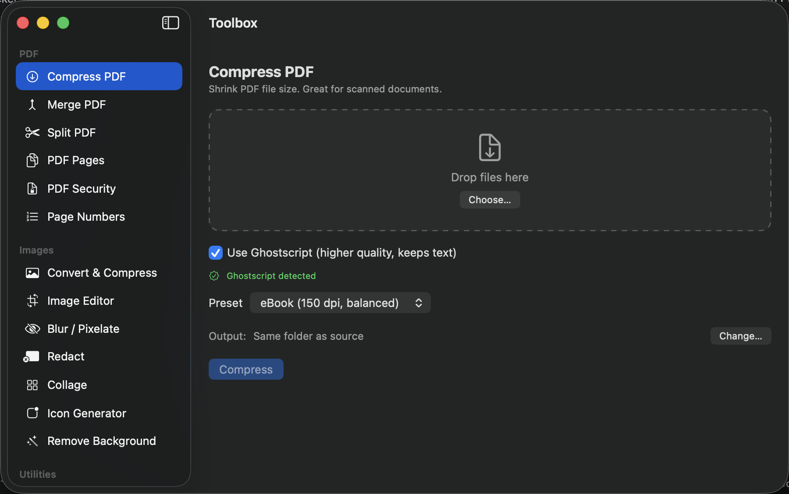

# Toolbox

Native macOS PDF & image toolkit. Pure Swift + SwiftUI, no Xcode, zero third-party
dependencies. Offline and private — nothing leaves your Mac.



## Prerequisites

- **macOS 13+** and the **Swift toolchain** (`swift --version`) — required to build.
- **Ghostscript** (recommended) — for high-quality, text-preserving PDF compression:

  ```bash
  brew install ghostscript
  ```

  Without it the app still runs, but Compress PDF falls back to native
  rasterization (good for scans, not for text PDFs). The app auto-detects `gs`
  at `/opt/homebrew/bin`, `/usr/local/bin`, or on `PATH`.
- **logo.jpg** in the project root — the build turns it into the app icon
  (optional; skipped if absent).

## Build & run

```bash
./build.sh
```

`build.sh` compiles the sources, generates the app icon from `logo.jpg`, bundles
`Toolbox.app`, and installs it to `/Applications`. Launch it from Launchpad /
Spotlight, or:

```bash
open /Applications/Toolbox.app
```

## Compression presets (Compress PDF)

Ghostscript mode offers presets — pick based on how small you need it:

| Preset | Image DPI | Use for |
|--------|-----------|---------|
| Screen | 72 | Email / smallest size (biggest reduction) |
| eBook | 150 | Balanced (default) |
| Printer | 300 | High quality (may not shrink text PDFs) |

Text/vector PDFs compress less than scans — most of their size is already-small
fonts and vectors, not downsamplable images. Use **Screen** for the deepest cuts.

## Features

- **Compress PDF** — Ghostscript (if installed) for high-quality, text-preserving
  compression; native rasterization fallback otherwise.
- **Merge PDF** — combine files; reorder by drag or ↑/↓ arrows.
- **Split PDF** — one file per page, or by page ranges (`1-3, 5, 8-10`).
- **PDF Pages** — rotate, delete, extract pages; PDF → images; images → PDF.
- **PDF Security** — add/remove password, diagonal watermark.
- **Page Numbers** — stamp page numbers/labels (`{n}`, `{total}`) at any corner/edge.
- **Convert & Compress** — *batch*: many images at once → change format (incl.
  HEIC → JPEG), compress by quality, cap max size, EXIF/GPS always stripped.
- **Image Editor** — *single image*: crop with draggable handles, rotate, flip,
  Paint-style Resize & Skew (percentage or pixels, keep aspect), live selection +
  output-size readout.
- **Blur / Pixelate** — drag over regions to hide faces/addresses/numbers, with live preview.
- **Redact** — permanently black out regions in a PDF or image (content underneath
  is destroyed, not just covered); choose fill color, live preview, multi-page PDF support.
- **Collage** — Grid / Horizontal / Vertical for uniform layouts, or **Freeform**: an
  interactive poster maker — drag, resize, rotate, and set opacity on each image, plus
  **Add Text** (font, size, color, bold/italic). Exports a full-res PNG.
- **Icon Generator** — image → favicon.ico + full PNG set (16–1024) + AppIcon.icns.
- **Remove Background** — one-click subject cutout (Vision, macOS 14+); keep it
  transparent or drop in a new **solid color / image** background, with live preview.
- **QR Code** — generate from text/URL (save PNG) and read/decode from images.
- **OCR / Text** — extract text from scanned PDFs/images, or build a **searchable
  PDF** (invisible selectable text layer) — on-device (Vision).

## Optional: stronger PDF compression

```bash
brew install ghostscript
```

The Compress PDF tool auto-detects it and shows a "Ghostscript detected" badge.

## Layout

```
Sources/
  App.swift, Tool.swift, Support.swift
  Components/  JobModel.swift, ToolScaffold.swift, RegionSelector.swift
               (drop well, numbered file list, output picker, interactive canvas)
  Services/    PDFService, ImageService, ImageEditService, CollageService,
               FreeformService, BackgroundService, IconService, QRService,
               OCRService, Ghostscript
  Views/       one per sidebar tool
```

Shared UX: numbered drag/arrow-reorderable file lists, right-side or in-place live
previews on image tools, and a remembered output folder (persisted across launches).

## Ideas for later

Sign PDF (draw/type signature), PDF metadata editor, extract embedded images, Freeform
snap/alignment guides, single-image text stamp in Image Editor, ⌘O/⌘S menu commands.
